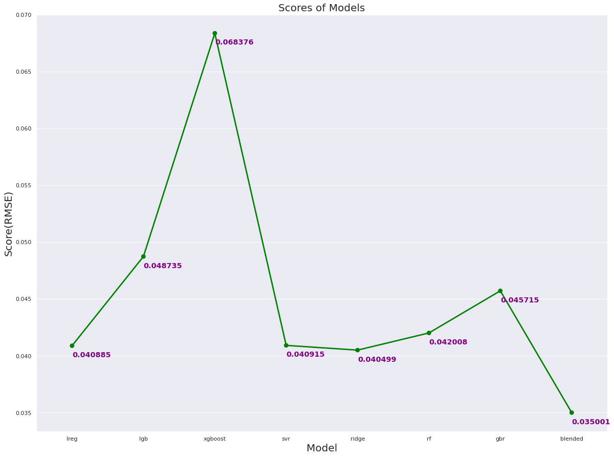

# Predicting graduate admissions
In this project I tried to predict graduate admissions based on a dataset published on [Kaggle, here.](https://www.kaggle.com/mohansacharya/graduate-admissions?select=Admission_Predict_Ver1.1.csv)

Specifically, My main goal of this project was to stack various _regression models_ on top of each other, to obtain the best results. Metric used to validate the models was RMSE score.
## Here are the broad steps taken:
- **Hypothesis Generation** – Understanding the problem and making and hypothesis.
- **Data Exploration** – Exloring and plotting categorical and numerical data, to understand and have an intuition. Here are the few plots 
- **Data Cleaning** – imputing missing values in the data and checking for outliers.
- **Feature Engineering** – modifying existing variables and creating new ones for analysis.
- **Model Building** – making predictive models on the data, Models used:
 - Linear Regression
 - LightGBM
 - Ridge Regression 
 - XGBoost Regressor
 - Random Forest Regressor
 - Support Vector Regressor
 - all models above, Stacked

## Model Performance:
Here is the final performance various models:

 
